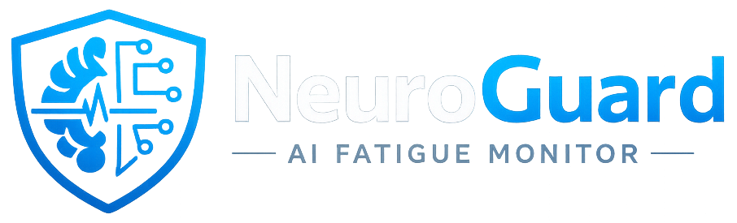

<!-- ========================================================= -->
<!--                      LOGO SECTION                         -->
<!-- ========================================================= -->

<p align="center">
  
</p>

<p align="center">
  <b>NeuroGuard - AI Fatigue Monitoring System</b><br>
  Real-time, fully offline drowsiness detection powered by computer vision.
</p>

<p align="center">
  
  
  
  
  
</p>

---

🧠 **NeuroGuard** is a real-time desktop driver drowsiness monitoring system built entirely in Python. It uses webcam-based facial landmark tracking and a rule-based fatigue scoring engine to detect:
- Long blinks  
- Micro-sleeps  
- Rapid blink clusters  
- Progressive fatigue build-up  

No machine learning training.  
No APIs.  
No cloud.  
No internet required after setup.  

Everything runs locally on CPU.

---
## 🚀 Features

- **Adaptive Calibration** — 60-second baseline EAR (Eye Aspect Ratio) calibration with a circular progress overlay
- **Low-Light Enhancement** — CLAHE (Contrast Limited Adaptive Histogram Equalization) preprocessing for reliable face detection in poor lighting
- **Event-Based Detection** — Classifies normal blinks, long blinks (0.7–2.5s), micro-sleeps (≥2.5s), and rapid blink clusters (≥7 in 15s)
- **Fatigue Scoring Engine** — Cumulative score (0–100) with dampening above warning threshold and natural time-based decay
- **Wide-Eye Recovery** — Fatigue score decays 4× faster when your EAR is well above baseline (eyes wide open)
- **2-Tier Alarm System** — Warning beeps at score ≥25, critical continuous alarm at score ≥60, all alarms silence below 40
- **Alarm Hysteresis** — Prevents alarm flicker; once triggered, alarms stay active until score drops below the silence threshold (40)
- **Excel Export** — Download a multi-sheet `.xlsx` report with real-time metrics, alarm event history (with timestamps), and session summary
- **Dark Theme GUI** — Professional dark-mode UI using PyQt6 with Font Awesome icons via `qtawesome`
- **Fullscreen Mode** — Toggle fullscreen via the ⛶ button in the header or press `F11` / `Esc`
- **CSV Session Logging** — All events are appended to `logs/session_log.csv` with millisecond timestamps

## 🛠 Tech Stack

| Component          | Technology                                 |
|--------------------|--------------------------------------------|
| Language           | Python 3.10+                               |
| Computer Vision    | OpenCV (with CLAHE)                        |
| Face Landmarks     | MediaPipe Face Landmarker (Tasks API)      |
| GUI Framework      | PyQt6                                      |
| Icons              | qtawesome (Font Awesome 5)                 |
| Numerical Ops      | NumPy                                      |
| Audio Alerts       | pygame                                     |
| Excel Export       | openpyxl                                   |
| Data Logging       | CSV (built-in `csv` module)                |

> Everything runs locally on CPU. No internet required after initial setup.

## 📂 Project Structure

```
# NeuroGuard/
├── main.py                 # Entry point — bootstraps PyQt6 app
├── gui.py                  # PyQt6 dashboard (camera feed, stats, fatigue bar)
├── detector.py             # Webcam capture + CLAHE + MediaPipe FaceLandmarker
├── fatigue_engine.py       # Calibration, event detection, scoring, alarm logic
├── alarm.py                # Audio alarm manager (warning + critical)
├── logger.py               # CSV session event logger
├── utils.py                # EAR computation and landmark helpers
├── config.py               # All constants, thresholds, and tuning parameters
├── generate_assets.py      # One-time setup: downloads model + generates sounds
├── assets/
│   ├── face_landmarker.task   # MediaPipe model (downloaded by generate_assets.py)
│   ├── warning.wav            # 3 beeps at 800 Hz
│   └── critical.wav           # Continuous tone at 1200 Hz
│   └── logo.png               # logo
│   └── favicon.png            # favicon
├── logs/
│   └── session_log.csv        # Auto-generated event log
└── README.md
└── LICENSE.txt
```

## ⚙ Installation

### 📋 Prerequisites

- Python 3.10 or higher
- A laptop/desktop with a webcam
- Working speakers or headphones (for alarm sounds)

### 🧩 Setup

```bash
# 1. Clone or navigate to the project directory
cd NeuroGuard

# 2. Create a virtual environment (recommended)
python -m venv .venv

# 3. Activate the virtual environment
# Windows:
.venv\Scripts\activate
# macOS/Linux:
# source .venv/bin/activate

# 4. Install dependencies
pip install opencv-python mediapipe numpy PyQt6 pygame qtawesome openpyxl

# 5. Download model and generate audio assets (one-time)
python generate_assets.py

# 6. Run the application
python main.py
```

## 🧠 How It Works

### 🔵 Phase 1: Calibration (60 seconds)

When the app starts, it enters a calibration phase to establish your personal EAR baseline. A **circular progress ring** appears over the camera feed showing the percentage complete. During this time:

- Look at the camera naturally with eyes open
- The system collects EAR samples and computes the median
- Your personalized blink threshold is calculated as `baseline × 0.70`

### 🟢 Phase 2: Monitoring

After calibration (+ 5-second grace period), the system begins detecting drowsiness events:

| Event               | Condition                          | Score Added |
|----------------------|------------------------------------|-------------|
| Normal blink         | Eye closure < 0.7s                 | 0           |
| Long blink           | Eye closure 0.7s – 2.5s           | +10         |
| Micro-sleep          | Eye closure ≥ 2.5s                 | +40         |
| Rapid blink cluster  | ≥ 7 blinks within 15 seconds       | +20         |

### 📉 Score Dampening

Once the fatigue score exceeds the warning threshold (25), all further event increments are **reduced by 50%**. This prevents the score from escalating too rapidly and gives the driver time to respond.

### 🔄 Score Decay

The fatigue score naturally decays over time:

| Condition              | Decay Rate       |
|------------------------|------------------|
| Normal (eyes open)     | 0.5 pts/sec      |
| Wide-eye open (EAR > baseline × 1.15) | 2.0 pts/sec (4× boost) |

This means actively opening your eyes wide will bring the fatigue score down faster.

### 🚨 Alarm Behaviour

| Score Range | Alarm State              | Sound                     |
|-------------|--------------------------|---------------------------|
| 0 – 24      | **NORMAL**               | Silent                    |
| 25 – 59     | **WARNING**              | Beep every 5 seconds      |
| 60 – 100    | **CRITICAL**             | Continuous alarm loop      |
| Drops < 40  | **SILENCE** (hysteresis) | All alarms stop            |

The hysteresis mechanism ensures that once alarms activate, they stay active until the score drops **below 40** — preventing annoying on/off flicker near the threshold.

## 🖥 GUI Overview

The interface is a single-window dark-themed dashboard:

- **Camera Feed** (left, 75% width) — Live annotated webcam view with face oval and eye contour overlays
- **Status Bar** — Shows current state (CALIBRATING / NORMAL / WARNING / CRITICAL / NO FACE) with contextual icons
- **Live Metrics Panel** (right, 25%) — 9 stat cards showing: Current EAR, Baseline EAR, EAR Threshold, Blink Duration, Blinks (60s), Low Frames, Fatigue Score, Micro-sleeps, FPS
- **Fatigue Progress Bar** — Bottom bar with color-coded fill and tier markers (W:25, OFF:40, CR:60)
- **Header Bar** — App title, session timer (HH:MM:SS), and fullscreen toggle
- **Export Button** — Generates a multi-sheet Excel report

### ⌨ Keyboard Shortcuts

| Key    | Action                |
|--------|-----------------------|
| `F11`  | Toggle fullscreen     |
| `Esc`  | Exit fullscreen       |

## 📥 Excel Export

Click the green **Export Report** button in the stats panel. The `.xlsx` file contains three sheets:

1. **Real-Time Metrics** — EAR, baseline, threshold, fatigue score, blink count, microsleep count, alarm level, and events (sampled every 2 seconds)
2. **Alarm Events** — Every alarm activation with timestamp, fatigue score at trigger, EAR at trigger, trigger event, and blink/microsleep counts
3. **Session Summary** — Duration, total snapshots, warning events count, critical events count

## ⚙ Configuration

All tuning parameters are in `config.py`. Key settings:

| Parameter                  | Default | Description                                    |
|----------------------------|---------|------------------------------------------------|
| `CALIBRATION_DURATION_SEC` | 60      | Calibration phase duration                     |
| `CALIBRATION_EAR_MULTIPLIER` | 0.70  | Threshold = baseline × this value              |
| `NORMAL_BLINK_MAX_DURATION` | 0.7s   | Max duration for a normal blink                |
| `LONG_BLINK_MAX_DURATION`  | 2.5s    | Max duration for a long blink                  |
| `MICROSLEEP_MIN_DURATION`  | 2.5s    | Minimum duration for micro-sleep               |
| `SCORE_LONG_BLINK`         | 10      | Score added per long blink                     |
| `SCORE_MICROSLEEP`         | 40      | Score added per micro-sleep                    |
| `SCORE_RAPID_BLINK_CLUSTER`| 20      | Score added per rapid blink cluster            |
| `SCORE_DECAY_PER_SEC`      | 0.5     | Points subtracted per second (natural decay)   |
| `SCORE_DAMPENING_FACTOR`   | 0.5     | Increment reduction above warning threshold    |
| `ALARM_WARNING_THRESHOLD`  | 25      | Fatigue score to trigger warning               |
| `ALARM_CRITICAL_THRESHOLD` | 60      | Fatigue score to trigger critical alarm        |
| `ALARM_SILENCE_THRESHOLD`  | 40      | Score below which all alarms stop              |
| `WIDE_EYE_EAR_MULTIPLIER`  | 1.15    | EAR must exceed baseline × 1.15 for boost      |
| `WIDE_EYE_DECAY_BOOST`     | 4.0     | Decay rate multiplier when eyes are wide open  |
| `MIN_DETECTION_CONFIDENCE` | 0.35    | MediaPipe face detection confidence (low-light)|
| `MIN_TRACKING_CONFIDENCE`  | 0.35    | MediaPipe face tracking confidence (low-light) |

## Module Reference

| Module              | Purpose                                                      |
|---------------------|--------------------------------------------------------------|
| `main.py`           | Application entry point, creates QApplication and MainWindow |
| `gui.py`            | PyQt6 dashboard: camera, stats, fatigue bar, export, fullscreen |
| `detector.py`       | Webcam capture, CLAHE enhancement, MediaPipe face detection  |
| `fatigue_engine.py` | Calibration, blink/event detection, scoring, alarm hysteresis |
| `alarm.py`          | Warning (repeating) and critical (continuous) audio playback |
| `logger.py`         | CSV event logging with timestamps                            |
| `utils.py`          | EAR computation and eye coordinate extraction                |
| `config.py`         | Centralized constants, thresholds, and paths                 |
| `generate_assets.py`| One-time setup: downloads MediaPipe model, generates WAV files |

## 🧪 Troubleshooting

| Issue                          | Solution                                                       |
|--------------------------------|----------------------------------------------------------------|
| `FileNotFoundError: face_landmarker` | Run `python generate_assets.py` first                    |
| No face detected in low light  | Ensure `MIN_DETECTION_CONFIDENCE` is set low (default 0.35)   |
| Score rises too fast           | Reduce score increments in `config.py` or increase `SCORE_DAMPENING_FACTOR` |
| Score drops too quickly         | Decrease `SCORE_DECAY_PER_SEC` (currently 0.5)                |
| Alarm won't stop               | Score must drop below `ALARM_SILENCE_THRESHOLD` (40)          |
| No sound from alarms           | Ensure speakers are on; check `assets/warning.wav` exists     |
| GUI feels slow                 | Lower `CAMERA_WIDTH`/`CAMERA_HEIGHT` in config                |

## 👥 Contributor

Made with ❤️ by **Sagnik Das**

## License

This project is licensed under the [MIT License](LICENSE).

## ☕️ Support Me
If you like this project, consider supporting me on Buy Me a Coffee:

[](https://coff.ee/dsagnik)

---

<p align="center"> <b>NeuroGuard - AI Fatigue Monitor</b> </p>
